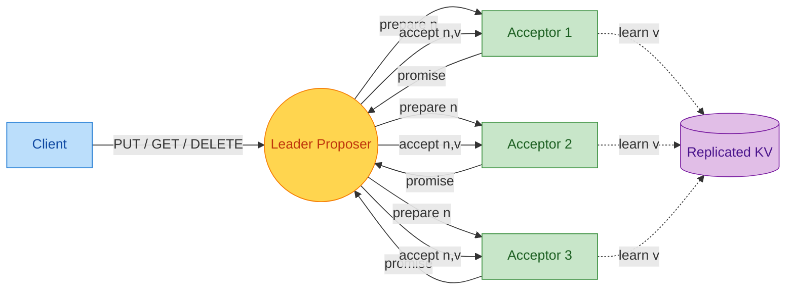
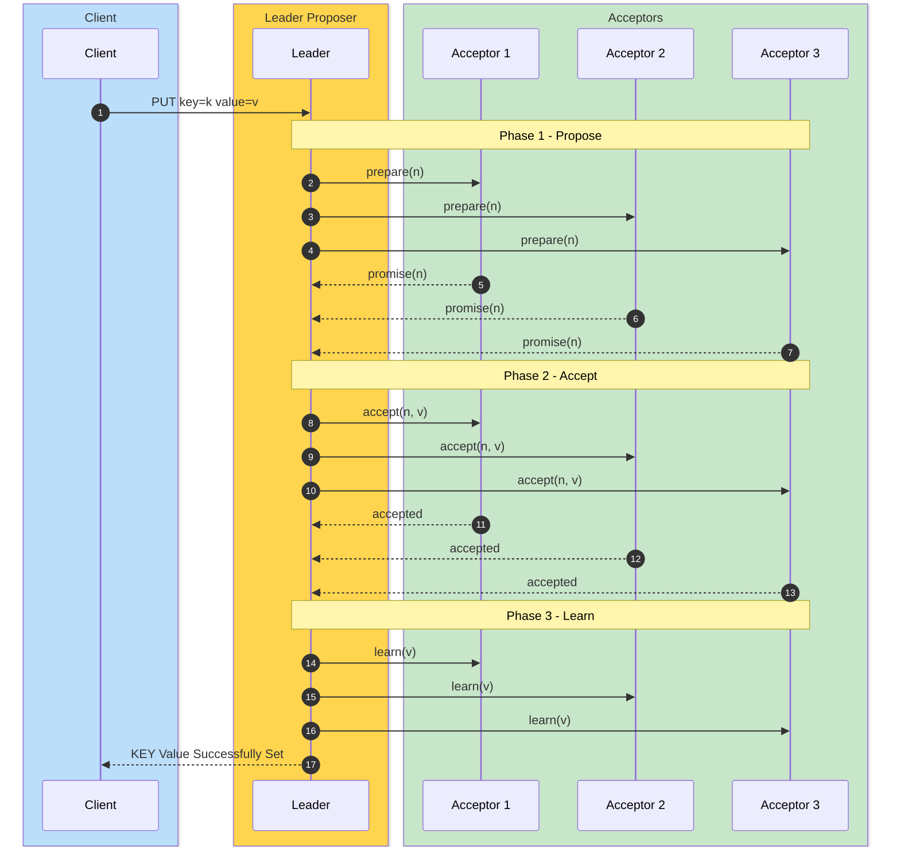
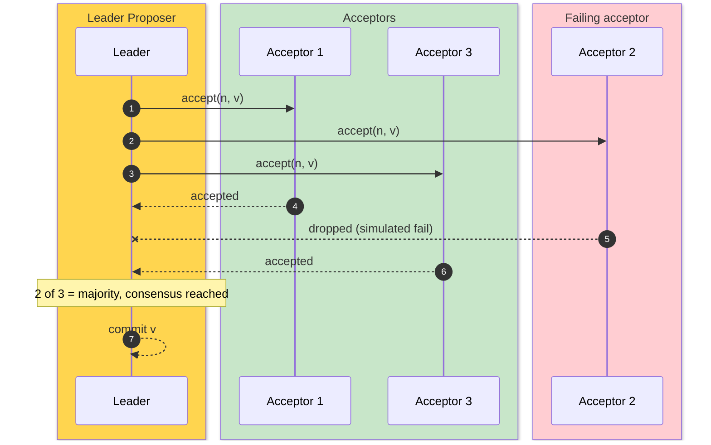
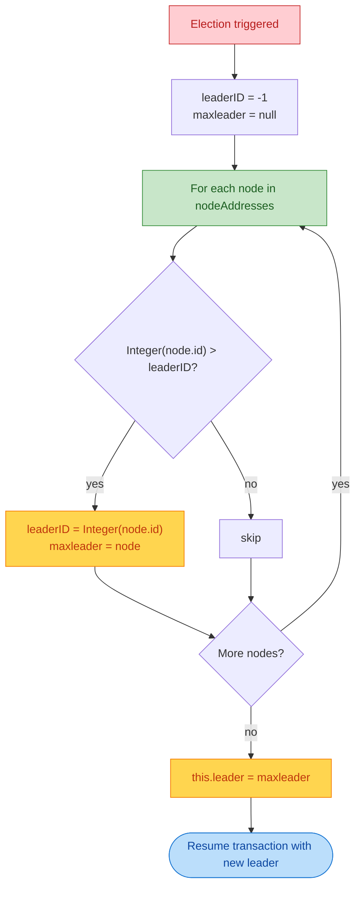

# PAXOS KEY-VALUE STORE

Paxos is a family of protocols for solving consensus in a network of unreliable or fallible processors. Consensus is the process of agreeing on one result among a group of participants. This problem becomes difficult when the participants or their communications may experience failures.


**Acceptor Failure fail**. The node will fail 10% of the times on accept.
**Proposer Failure fail**. The node will not "fail" at random time, but the program is designed to handle this failure. Explained later in this README.


# Requirements
1)  To achieve this goal you will implement Paxos to realize fault-tolerant consensus amongst your
replicated servers. Functionally, you must implement and integrate the Paxos roles we described in class,
and as described in the Lamport papers, including the **Proposers, Acceptors, and Learners**.  To minimize the
potential for live lock, you may choose to use **leader election amongst the proposers**, however, that is not
a strict requirement of the project.
2) A second requirement for this project is that the **acceptors must be configured to "fail" at random times.**
   Each of the roles within Paxos may be implemented at threads or processes - that's up to you to determine
   how to implement (I'd use threads).  **A new acceptor thread could then be restarted after
   another delay which should resume the functions of the previous acceptor thread**, even though it clearly
   won't have the same state as the previously killed thread. Once this is completed, **you may earn extra
   credit for the project if all roles are constructed to randomly fail and restart**, but only the failure/restart of
   the acceptor is required. This should make it clear how Paxos overcomes replicated server failures.

# Overview of Paxos

Every node in the cluster runs all three Paxos roles at once: it is a **Proposer**, an **Acceptor**, and a **Learner**. One node is elected **Leader** and is the only one that drives client transactions.

## Protocol

The leader runs three phases for every transaction. A strict majority of acceptors must respond at every phase for the value to be chosen, and the protocol retries the whole sequence with a fresh sequence number if any phase falls short.

1. **Phase 1 - Propose (Prepare).** The leader picks a sequence number `n` larger than anything it has used and calls `Propose(n)` on every acceptor. An acceptor that has not promised a higher number records `n` as its new `PromisedSequenceNumber` and replies `Ack.YES`. An acceptor that has already promised a higher number replies `Ack.NO`.
2. **Phase 2 - Accept.** Once the leader collects a majority of `YES` votes, it calls `Accept(n, v)` on every acceptor with the proposed value `v`. Acceptors whose promise still matches `n` reply with the accepted packet; stale proposals are returned with the response field set to `Ignored`. This is the phase wrapped in the simulated 10 percent failure on each acceptor, so the leader counts successful accepts against a majority threshold before continuing.
3. **Phase 3 - Learn.** With a majority of accepts, the leader calls `Learn(v)` on every node, which dispatches the PUT / GET / DELETE through `KeyValueStore` and emits the response back to the client. If the leader did not get a majority of accepts the whole sequence is retried with a fresh `n`.




## Normal Happy Path

The leader drives a three-phase exchange. A majority of acceptors must reply at every phase for the value to be committed.




## On Acceptor Failure

Acceptors fail at random with a 10 percent probability per accept. As long as a strict majority still responds, consensus is reached and the value is committed across the network.




## Leader Failing

Before a node informs the leader, it checks `leader.isAlive()`. If the leader does not respond, the node assumes it is dead, removes it from the network, informs the other nodes of the new state, and runs a fresh leader election. The new leader then takes over driving transactions. An example script is provided in **testBash/testLeaderFail.sh**.


## Leader Election

Election itself is a deterministic **max-ID wins** rule, not a voting round. Every node runs `runLeaderElection()` in **Node.java** independently and walks its own `nodeAddresses` set, picking the `NodeAddress` whose numeric ID is the largest. Because every node keeps the same view of `nodeAddresses` through the `inform` / `informOfNewNode` flow, all of them converge on the same leader without exchanging extra messages.

It is triggered in three situations:

- The very first transaction lands on a node and `leader` is still `null` (first call to `Put` / `Get` / `Delete`).
- `leader.isAlive()` returns `false`. That call is an RMI lookup for `Node-<id>` against the recorded IP and port (see `NodeAddress.isAlive()`); any `RemoteException` or `NotBoundException` is treated as dead.
- A peer notices the leader is gone, removes it from its own `nodeAddresses`, calls `informOfNewNode()` to push the new view to everyone, and reruns the election.



This keeps the implementation small but has a real consequence: a node that has not yet been informed of the latest membership change can briefly disagree about who the leader is, which is why the first thing the leader does on a new transaction is verify `leader.isAlive()` and rerun the election if it does not match.


# Building

Requires Java 17+ and Maven. The shaded jar is produced by the Maven Shade Plugin with the Node main class wired into the manifest.

```shell
make build
```

That runs `mvn clean package` under the hood and drops a single fat jar at **target/KVStore2PC.jar**. If you prefer to drive Maven directly:

```shell
mvn clean package -DskipTests
```

To see every Makefile target:

```shell
make help
```


# Docker

The same cluster can run as five containers on a user-defined bridge network, one Paxos node per container, with no port collisions on the host. Image build is multi-stage (Maven build then JRE runtime), so a host Java/Maven install is not required to run the dockerized cluster.

```shell
make docker-build    # build the paxos-kvstore image
make docker-up       # start node0..node4 on the paxos_net bridge
make docker-client   # interactive REPL against the live cluster
make docker-test     # canned PUT/GET round-trip
make docker-down     # tear it all down
```

The five services are `node0` (init) through `node4`. Joiners wait on `node0`'s TCP healthcheck on port 1099 via `depends_on: condition: service_healthy`, so they will not race the RMI registry bind. Container hostnames match service names, and `-Djava.rmi.server.hostname` is wired through `JAVA_TOOL_OPTIONS` so RMI stubs advertise reachable names.

Simulated acceptor / proposer failure rates are read from `ACCEPT_FAIL` / `PROPOSE_FAIL` env vars (default `0.1`, matching the localhost flow). `docker-compose.yml` sets both to `0.0` for deterministic test runs; override per-service to demo failure recovery.

Sample `make docker-client` session:

```
$ make docker-client
PAXOS KV client. Commands:
  put <key> <value>
  get <key>
  delete <key>
  exit
paxos> put HELLO WORLD
Recieved Response (...):KEY Value Successfully Set
paxos> get HELLO
Recieved Response (...):WORLD
paxos> delete HELLO
Recieved Response (...):Key-Value Successfully Deleted
paxos> exit
```

The friendly syntax is a thin bash wrapper around the existing `Client.java`; the underlying packet format documented in **Request Types** still works as a raw passthrough.


# Running the Initial Node

```shell
# Terminal 1 - Initial node
java -jar target/KVStore2PC.jar 0 127.0.0.1 1099 127.0.0.1 1099 --init
```

Or via the Makefile:

```shell
make run-init
```


# Joining the Network

Each joining node takes a unique ID and port and points back at the initial node:

```shell
java -jar target/KVStore2PC.jar <ID> 127.0.0.1 <PORT> 127.0.0.1 1099
```

For example, nodes 1 through 10:

```shell
for i in $(seq 1 10); do
  java -jar target/KVStore2PC.jar $i 127.0.0.1 $((1099 + i)) 127.0.0.1 1099 &
done
```

Or, parameterized through the Makefile:

```shell
make run-node ID=1 PORT=1100
make run-node ID=2 PORT=1101
# ...
```

Sample output when a node joins:

```
$ java -jar target/KVStore2PC.jar 10 127.0.0.1 1109 127.0.0.1 1099
$ This node will connect to the initial node at 127.0.0.1:1099
$ Node ID: 10
$ Node IP: 127.0.0.1
$ Listening on port: 1109
$ Connecting to init node at 127.0.0.1:1099
$ Node Registry started on port 1109
$ Node 10 bound in registry at Node-10
$ Connecting to initial node at 127.0.0.1:1099
$ Informing 11 nodes
$ NodeAddress [id=9, ip=127.0.0.1, port=1108]
$ NodeAddress [id=7, ip=127.0.0.1, port=1106]
$ NodeAddress [id=3, ip=127.0.0.1, port=1102]
$ NodeAddress [id=8, ip=127.0.0.1, port=1107]
$ NodeAddress [id=6, ip=127.0.0.1, port=1105]
$ NodeAddress [id=2, ip=127.0.0.1, port=1101]
$ NodeAddress [id=1, ip=127.0.0.1, port=1100]
$ NodeAddress [id=10, ip=127.0.0.1, port=1109]
$ NodeAddress [id=5, ip=127.0.0.1, port=1104]
$ NodeAddress [id=0, ip=127.0.0.1, port=1099]
$ NodeAddress [id=4, ip=127.0.0.1, port=1103]
$ Response from initial node: Joined
$ Successfully joined the network.
$ Successfully joined the Paxos network!
```


# Client Perspective

```shell
java -cp target/KVStore2PC.jar manuel.rpckvstore.Client 127.0.0.1 1099
```

Or:

```shell
make run-client
```

Sample run showing successive PUTs followed by DELETEs of the same keys:

```
Attempting to connect to server at 127.0.0.1:1099
Get stub
Connected successfully!
Recieved Response (2025-04-12 13:56:44.669):KEY Value Successfully Set
Recieved Response (2025-04-12 13:56:44.760):KEY Value Successfully Set
Recieved Response (2025-04-12 13:56:44.797):KEY Value Successfully Set
Recieved Response (2025-04-12 13:56:44.831):KEY Value Successfully Set
Recieved Response (2025-04-12 13:56:44.863):KEY Value Successfully Set
Recieved Response (2025-04-12 13:56:44.997):KEY Value Successfully Set
Recieved Response (2025-04-12 13:56:45.232):MAEPRQEFEVMEDHAGTYGLGDRKDQGGYTMHQDQEGDTDAGLKESPLQTPTEDGSEEPGSETSDAKSTPTAEDVTAPLVDEGAPGKQAA...
Recieved Response (2025-04-12 13:56:45.365):MLPGLALLLLAAWTARALEVPTDGNAGLLAEPQIAMFCGRLNMHMNVQNGKWDSDPSGTKTCIDTKEGILQYCQEVYPELQITNVVEAN...
Recieved Response (2025-04-12 13:56:46.209):Key-Value Successfully Deleted
Recieved Response (2025-04-12 13:56:46.238):Key-Value Successfully Deleted
Recieved Response (2025-04-12 13:56:46.467):Key-Value Successfully Deleted
Recieved Response (2025-04-12 13:56:46.597):Key-Value Successfully Deleted
Recieved Response (2025-04-12 13:56:46.724):Key-Value Successfully Deleted
Recieved Response (2025-04-12 13:56:46.751):Key-Value Successfully Deleted
```


# Leader Perspective

Abbreviated leader log for one transaction showing the three phases, a simulated acceptor failure, and the recovery:

```
Recieved Request ( 2025-04-12 13:56:44.305):{TYPE:PUT,KEY:P10636,VALUE:MAEPRQEFEVMEDHAGTYGLG...}
========GET THE VOTES: Phase 1: Propose Phase========
NodeAddress [id=9, ip=127.0.0.1, port=1108]
NodeAddress [id=7, ip=127.0.0.1, port=1106]
NodeAddress [id=3, ip=127.0.0.1, port=1102]
...
PromisedSequenceNumber is null
PromisedSequenceNumber is 1.1
========GET THE : Phase 1: Accept Phase========
========Learning===============
Reponse Sent (2025-04-12 13:56:44.423):KEY Value Successfully Set
========Learning===============
Reponse Sent (2025-04-12 13:56:44.463):KEY Value Successfully Set
========Learning===============
Reponse Sent (2025-04-12 13:56:44.503):KEY Value Successfully Set
There was a problem commiting at node
This is likely due to simulated ACCEPTOR FAILURE
Paxos is still alive. Majority node accepted
========Learning===============
Reponse Sent (2025-04-12 13:56:44.533):KEY Value Successfully Set
========Committing===============
Committing
Reponse Sent (2025-04-12 13:56:44.550):KEY Value Successfully Set
========Number Of Accepted Node========
9
=======================================
```


# Run 10 Nodes

```shell
bash scripts/10Server.sh
```

Or:

```shell
make run-cluster
```


# Run Client Nodes

```shell
cd testBash
bash Client.sh
```


# Cleaning Your Port

```shell
make kill-ports
```

Or the original way:

```shell
npx kill-port 1099 1100 1101 1102 1103 1104 1105 1106 1107 1108 1109
```


# Request Types

```shell
{TYPE:PUT, KEY:HELLO, VALUE:WORLD}
{TYPE:GET, KEY:HELLO}
{TYPE:DELETE, KEY:HELLO}
```


# Tests

```shell
make test
```

Runs the full Maven test suite. It is broken into three pieces:

- **NodeTest** (JUnit 5): single-node coverage of the constructor, KeyValueStore semantics (put/get/delete, missing-key sentinel, duplicate refusal), and the `Propose()` promise tracking. Eight multi-node placeholders are marked `@Disabled` because they need a running RMI cluster and are covered by the bash scripts under **testBash/** instead.
- **WritePathTest** (JUnit 5): in-process exercise of the PROPOSE / ACCEPT / LEARN write path with zero simulated failure rate. Covers PUT propagation, stale-sequence rejection, idempotent delete, duplicate-put refusal, and GET as a no-op.
- **RunCucumberTest** (Cucumber + JUnit Platform Suite): BDD scenarios in **src/test/resources/features/kvstore.feature** backed by the step definitions in **src/test/java/manuel/rpckvstore/bdd/steps/KVStoreSteps.java**. Same data contract as NodeTest, just written as Given / When / Then so the behavior is readable.

For just the cucumber suite:

```shell
make cucumber
```

Latest run on **dev** and **main**: `Tests run: 35, Failures: 0, Errors: 0, Skipped: 8`.


# Make Targets

| Target | What it does |
|--------|--------------|
| `make build` | `mvn clean package`, produces target/KVStore2PC.jar |
| `make test` | runs JUnit 5 + Cucumber suites |
| `make cucumber` | runs only the cucumber suite |
| `make clean` | `mvn clean` plus removes out/ and __MACOSX/ |
| `make run-init` | starts the initial node on 127.0.0.1:1099 |
| `make run-node ID=N PORT=P` | starts a joining node |
| `make run-client` | runs the client against 127.0.0.1:1099 |
| `make run-cluster` | shells out to scripts/10Server.sh |
| `make test-leader-fail` | shells out to testBash/testLeaderFail.sh |
| `make kill-ports` | kills stale java/rmiregistry processes on 1099-1110 |
| `make docker-build` | builds the paxos-kvstore image |
| `make docker-up` | starts the 5-node dockerized cluster |
| `make docker-down` | tears the dockerized cluster down |
| `make docker-test` | canned PUT/GET round-trip against the dockerized cluster |
| `make docker-client` | interactive REPL against the dockerized cluster |
| `make docker-logs` | follows docker compose logs |
| `make help` | prints the same list |
