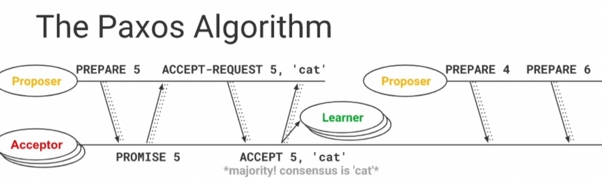
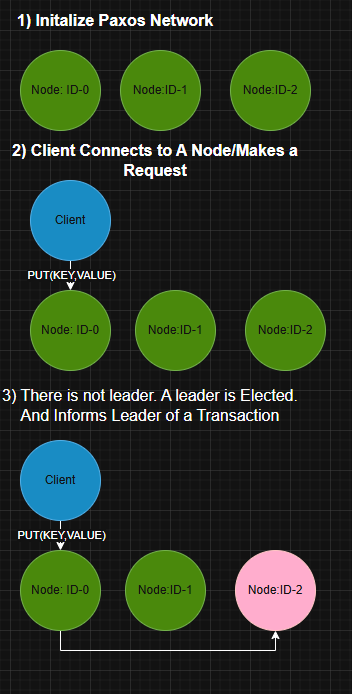
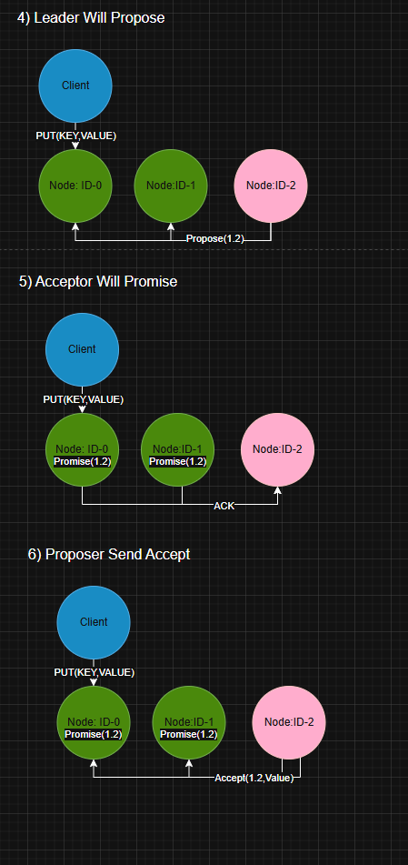
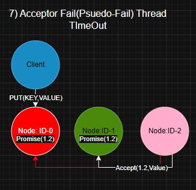

# PAXOS KEY-VALUE STORE

Paxos is a family of protocols for solving consensus in a network of unreliable or fallible processors. Consensus is the process of agreeing on one result among a group of participants. This problem becomes difficult when the participants or their communications may experience failures.


**Acceptor Failure fail**. The node will fail 10% of the times on accept.
**Proposer Failure fail**. The node will not "fail" at random time, but the program is designed to handle this failure. Explained later in this README.


# Requirements
1)  To achieve this goal you will implement Paxos to realize fault-tolerant consensus amongst your
replicated servers. Functionally, you must implement and integrate the Paxos roles we described in class,
and as described in the Lamport papers, including the **Proposers, Acceptors, and Learners**.  To minimize the
potential for live lock, you may choose to use **leader election amongst the proposers**, however, that is not
a strict requirement of the project.
2) A second requirement for this project is that the **acceptors must be configured to "fail" at random times.**
   Each of the roles within Paxos may be implemented at threads or processes - that's up to you to determine
   how to implement (I'd use threads).  **A new acceptor thread could then be restarted after
   another delay which should resume the functions of the previous acceptor thread**, even though it clearly
   won't have the same state as the previously killed thread. Once this is completed, **you may earn extra
   credit for the project if all roles are constructed to randomly fail and restart**, but only the failure/restart of
   the acceptor is required. This should make it clear how Paxos overcomes replicated server failures.

# Overview of Paxos:





# From our requirement our system will look like this :

## Normal Paxos




## On Acceptor Fail


If a majority has still responded to accept. Consensus has still been reached.


## Leader Failing

Before a node informs the leader, the node checks if the leader isAlive(). If the leader does not issue response, the node will
assume the leader is dead. Removes the leader from the network, informs others of the new state of the network, and runs a new leader election.
This new node will act as leader. An example script has been provided in **testBash/testLeaderFail.sh**.


# Building

Requires Java 17+ and Maven. The shaded jar is produced by the Maven Shade Plugin with the Node main class wired into the manifest.

```shell
make build
```

That runs `mvn clean package` under the hood and drops a single fat jar at **target/KVStore2PC.jar**. If you prefer to drive Maven directly:

```shell
mvn clean package -DskipTests
```

To see every Makefile target:
```shell
make help
```


# Running Inital Node:
```shell
# Terminal 1 - Initial node
java -jar target/KVStore2PC.jar 0 127.0.0.1 1099 127.0.0.1 1099 --init
```

Or via the Makefile:
```shell
make run-init
```


# Running Joining The Server


```shell
java -jar target/KVStore2PC.jar 1 127.0.0.1 1100 127.0.0.1 1099

```

```shell
java -jar target/KVStore2PC.jar 2 127.0.0.1 1101 127.0.0.1 1099

```

```shell
java -jar target/KVStore2PC.jar 3 127.0.0.1 1102 127.0.0.1 1099

```

```shell
java -jar target/KVStore2PC.jar 4 127.0.0.1 1103 127.0.0.1 1099

```
```shell
java -jar target/KVStore2PC.jar 5 127.0.0.1 1104 127.0.0.1 1099

```
```shell
java -jar target/KVStore2PC.jar 6 127.0.0.1 1105 127.0.0.1 1099

```
```shell
java -jar target/KVStore2PC.jar 7 127.0.0.1 1106 127.0.0.1 1099

```
```shell
java -jar target/KVStore2PC.jar 8 127.0.0.1 1107 127.0.0.1 1099

```
```shell
java -jar target/KVStore2PC.jar 9 127.0.0.1 1108 127.0.0.1 1099

```
```shell
java -jar target/KVStore2PC.jar 10 127.0.0.1 1109 127.0.0.1 1099
```

Or, parameterized through the Makefile:
```shell
make run-node ID=1 PORT=1100
make run-node ID=2 PORT=1101
# ...
```

On Node joining the Network
``` 
$ java -jar target/KVStore2PC.jar 10 127.0.0.1 1109 127.0.0.1 1099
$ This node will connect to the initial node at 127.0.0.1:1099
$ Node ID: 10
$ Node IP: 127.0.0.1
$ Listening on port: 1109
$ Connecting to init node at 127.0.0.1:1099
$ Node Registry started on port 1109
$ Node 10 bound in registry at Node-10
$ Connecting to initial node at 127.0.0.1:1099
$ Informing 11 nodes
$ NodeAddress [id=9, ip=127.0.0.1, port=1108]
$ NodeAddress [id=7, ip=127.0.0.1, port=1106]
$ NodeAddress [id=3, ip=127.0.0.1, port=1102]
$ NodeAddress [id=8, ip=127.0.0.1, port=1107]
$ NodeAddress [id=6, ip=127.0.0.1, port=1105]
$ NodeAddress [id=2, ip=127.0.0.1, port=1101]
$ NodeAddress [id=1, ip=127.0.0.1, port=1100]
$ NodeAddress [id=10, ip=127.0.0.1, port=1109]
$ NodeAddress [id=5, ip=127.0.0.1, port=1104]
$ NodeAddress [id=0, ip=127.0.0.1, port=1099]
$ NodeAddress [id=4, ip=127.0.0.1, port=1103]
$ Response from initial node: Joined
$ Successfully joined the network.
$ Successfully joined the Paxos network!
```


# Client Perspective
```shell
java -cp target/KVStore2PC.jar manuel.rpckvstore.Client 127.0.0.1 1099
```

Or:
```shell
make run-client
```

```
Attempting to connect to server at 127.0.0.1:1099
Get stub
Connected successfully!
Recieved Response (2025-04-12 13:56:44.669):KEY Value Successfully Set
Recieved Response (2025-04-12 13:56:44.760):KEY Value Successfully Set
Recieved Response (2025-04-12 13:56:44.797):KEY Value Successfully Set
Recieved Response (2025-04-12 13:56:44.831):KEY Value Successfully Set
Recieved Response (2025-04-12 13:56:44.863):KEY Value Successfully Set
Recieved Response (2025-04-12 13:56:44.997):KEY Value Successfully Set
Recieved Response (2025-04-12 13:56:45.232):MAEPRQEFEVMEDHAGTYGLGDRKDQGGYTMHQDQEGDTDAGLKESPLQTPTEDGSEEPGSETSDAKSTPTAEDVTAPLVDEGAPGKQAAAQPHTEIPEGTTAEEAGIGDTPSLEDEAAGHVTQEPESGKVVQEGFLREPGPPGLSHQLMSGMPGAPLLPEGPREATRQPSGTGPEDTEGGRHAPELLKHQLLGDLHQEGPPLKGAGGKERPGSKEEVDEDRDVDESSPQDSPPSKASPAQDGRPPQTAAREATSIPGFPAEGAIPLPVDFLSKVSTEIPASEPDGPSVGRAKGQDAPLEFTFHVEITPNVQKEQAHSEEHLGRAAFPGAPGEGPEARGPSLGEDTKEADLPEPSEKQPAAAPRGKPVSRVPQLKARMVSKSKDGTGSDDKKAKTSTRSSAKTLKNRPCLSPKHPTPGSSDPLIQPSSPAVCPEPPSSPKYVSSVTSRTGSSGAKEMKLKGADGKTKIATPRGAAPPGQKGQANATRIPAKTPPAPKTPPSSGEPPKSGDRSGYSSPGSPGTPGSRSRTPSLPTPPTREPKKVAVVRTPPKSPSSAKSRLQTAPVPMPDLKNVKSKIGSTENLKHQPGGGKVQIINKKLDLSNVQSKCGSKDNIKHVPGGGSVQIVYKPVDLSKVTSKCGSLGNIHHKPGGGQVEVKSEKLDFKDRVQSKIGSLDNITHVPGGGNKKIETHKLTFRENAKAKTDHGAEIVYKSPVVSGDTSPRHLSNVSSTGSIDMVDSPQLATLADEVSASLAKQGL
Recieved Response (2025-04-12 13:56:45.365):MLPGLALLLLAAWTARALEVPTDGNAGLLAEPQIAMFCGRLNMHMNVQNGKWDSDPSGTKTCIDTKEGILQYCQEVYPELQITNVVEANQPVTIQNWCKRGRKQCKTHPHFVIPYRCLVGEFVSDALLVPDKCKFLHQERMDVCETHLHWHTVAKETCSEKSTNLHDYGMLLPCGIDKFRGVEFVCCPLAEESDNVDSADAEEDDSDVWWGGADTDYADGSEDKVVEVAEEEEVAEVEEEEADDDEDDEDGDEVEEEAEEPYEEATERTTSIATTTTTTTESVEEVVREVCSEQAETGPCRAMISRWYFDVTEGKCAPFFYGGCGGNRNNFDTEEYCMAVCGSAMSQSLLKTTQEPLARDPVKLPTTAASTPDAVDKYLETPGDENEHAHFQKAKERLEAKHRERMSQVMREWEEAERQAKNLPKADKKAVIQHFQEKVESLEQEAANERQQLVETHMARVEAMLNDRRRLALENYITALQAVPPRPRHVFNMLKKYVRAEQKDRQHTLKHFEHVRMVDPKKAAQIRSQVMTHLRVIYERMNQSLSLLYNVPAVAEEIQDEVDELLQKEQNYSDDVLANMISEPRISYGNDALMPSLTETKTTVELLPVNGEFSLDDLQPWHSFGADSVPANTENEVEPVDARPAADRGLTTRPGSGLTNIKTEEISEVKMDAEFRHDSGYEVHHQKLVFFAEDVGSNKGAIIGLMVGGVVIATVIVITLVMLKKKQYTSIHHGVVEVDAAVTPEERHLSKMQQNGYENPTYKFFEQMQN
Recieved Response (2025-04-12 13:56:45.682):MAAPDLSTNLQEEATCAICLDYFTDPVMTDCGHNFCRECIRRCWGQPEGPYACPECRELSPQRNLRPNRPLAKMAEMARRLHPPSPVPQGVCPAHREPLAAFCGDELRLLCAACERSGEHWAHRVRPLQDAAEDLKAKLEKSLEHLRKQMQDALLFQAQADETCVLWQKMVESQRQNVLGEFERLRRLLAEEEQQLLQRLEEEELEVLPRLREGAAHLGQQSAHLAELIAELEGRCQLPALGLLQDIKDALRRVQDVKLQPPEVVPMELRTVCRVPGLVETLRRFRGDVTLDPDTANPELILSEDRRSVQRGDLRQALPDSPERFDPGPCVLGQERFTSGRHYWEVEVGDRTSWALGVCRENVNRKEKGELSAGNGFWILVFLGSYYNSSERALAPLRDPPRRVGIFLDYEAGHLSFYSATDGSLLFIFPEIPFSGTLRPLFSPLSSSPTPMTICRPKGGSGDTLAPQ
Recieved Response (2025-04-12 13:56:45.716):MLHVEMLTLVFLVLWMCVFSQDPGSKAVADRYAVYWNSSNPRFQRGDYHIDVCINDYLDVFCPHYEDSVPEDKTERYVLYMVNFDGYSACDHTSKGFKRWECNRPHSPNGPLKFSEKFQLFTPFSLGFEFRPGREYFYISSAIPDNGRRSCLKLKVFVRPTNSCMKTIGVHDRVFDVNDKVENSLEPADDTVHESAEPSRGENAAQTPRIPSRLLAILLFLLAMLLTL
Recieved Response (2025-04-12 13:56:45.845):MKVLWAALLVTFLAGCQAKVEQAVETEPEPELRQQTEWQSGQRWELALGRFWDYLRWVQTLSEQVQEELLSSQVTQELRALMDETMKELKAYKSELEEQLTPVAEETRARLSKELQAAQARLGADMEDVCGRLVQYRGEVQAMLGQSTEELRVRLASHLRKLRKRLLRDADDLQKRLAVYQAGAREGAERGLSAIRERLGPLVEQGRVRAATVGSLAGQPLQERAQAWGERLRARMEEMGSRTRDRLDEVKEQVAEVRAKLEEQAQQIRLQAEAFQARLKSWFEPLVEDMQRQWAGLVEKVQAAVGTSAAPVPSDNH
Recieved Response (2025-04-12 13:56:45.876):MAQALPWLLLWMGAGVLPAHGTQHGIRLPLRSGLGGAPLGLRLPRETDEEPEEPGRRGSFVEMVDNLRGKSGQGYYVEMTVGSPPQTLNILVDTGSSNFAVGAAPHPFLHRYYQRQLSSTYRDLRKGVYVPYTQGKWEGELGTDLVSIPHGPNVTVRANIAAITESDKFFINGSNWEGILGLAYAEIARPDDSLEPFFDSLVKQTHVPNLFSLQLCGAGFPLNQSEVLASVGGSMIIGGIDHSLYTGSLWYTPIRREWYYEVIIVRVEINGQDLKMDCKEYNYDKSIVDSGTTNLRLPKKVFEAAVKSIKAASSTEKFPDGFWLGEQLVCWQAGTTPWNIFPVISLYLMGEVTNQSFRITILPQQYLRPVEDVATSQDDCYKFAISQSSTGTVMGAVIMEGFYVVFDRARKRIGFAVSACHVHDEFRTAAVEGPFVTLDMEDCGYNIPQTDESTLMTIAYVMAAICALFMLPLCLMVCQWRCLRCLRQQHDDFADDISLLK
Recieved Response (2025-04-12 13:56:46.209):Key-Value Successfully Deleted
Recieved Response (2025-04-12 13:56:46.238):Key-Value Successfully Deleted
Recieved Response (2025-04-12 13:56:46.467):Key-Value Successfully Deleted
Recieved Response (2025-04-12 13:56:46.597):Key-Value Successfully Deleted
Recieved Response (2025-04-12 13:56:46.724):Key-Value Successfully Deleted
Recieved Response (2025-04-12 13:56:46.751):Key-Value Successfully Deleted
```

# Leader Perspective (Abbreviated to show one transaction) :
```shell
...
Recieved Request ( 2025-04-12 13:56:44.305):{TYPE:PUT,KEY:P10636,VALUE:MAEPRQEFEVMEDHAGTYGLGDRKDQGGYTMHQDQEGDTDAGLKESPLQTPTEDGSEEPGSETSDAKSTPTAEDVTAPLVDEGAPGKQAAAQPHTEIPEGTTAEEAGIGDTPSLEDEAAGHVTQEPESGKVVQEGFLREPGPPGLSHQLMSGMPGAPLLPEGPREATRQPSGTGPEDTEGGRHAPELLKHQLLGDLHQEGPPLKGAGGKERPGSKEEVDEDRDVDESSPQDS
PPSKASPAQDGRPPQTAAREATSIPGFPAEGAIPLPVDFLSKVSTEIPASEPDGPSVGRAKGQDAPLEFTFHVEITPNVQKEQAHSEEHLGRAAFPGAPGEGPEARGPSLGEDTKEADLPEPSEKQPAAAPRGKPVSRVPQLKARMVSKSKDGTGSDDKKAKTSTRSSAKTLKNRPCLSPKHPTPGSSDPLIQPSSPAVCPEPPSSPKYVSSVTSRTGSSGAKEMKLKGADGKTKIATPRGAAPPGQKGQANATRIPAKTPPAPKTPPSSGEPPKSGDRSGYSSPGSPGTPGSRSRTPSLPTPPTREPKKVAVVRTPPKSPSSAKSRLQTAPVPMPDLKNVKSKIGSTENLKHQPGGGKVQIINKKLDLSNVQSKCGSKDNIKHVPGGGSVQIVYKPVDLSKVTSKCGSLGNIHHKPGGGQVEVKSEKLDFKDRVQSKIGSLDNITHVPGGGNKKIETHKLTFRENAKAKTDHGAEIVYKSPVVSGDTSPRHLSNVSSTGSIDMVDSPQLATLADEVSASLAKQGL}
========GET THE VOTES: Phase 1: Propose Phase========
NodeAddress [id=9, ip=127.0.0.1, port=1108]
NodeAddress [id=7, ip=127.0.0.1, port=1106]
NodeAddress [id=3, ip=127.0.0.1, port=1102]
NodeAddress [id=8, ip=127.0.0.1, port=1107]
NodeAddress [id=6, ip=127.0.0.1, port=1105]
NodeAddress [id=2, ip=127.0.0.1, port=1101]
NodeAddress [id=1, ip=127.0.0.1, port=1100]
NodeAddress [id=10, ip=127.0.0.1, port=1109]
PromisedSequenceNumber is null
PromisedSequenceNumber is 1.1
NodeAddress [id=5, ip=127.0.0.1, port=1104]
NodeAddress [id=0, ip=127.0.0.1, port=1099]
NodeAddress [id=4, ip=127.0.0.1, port=1103]
========GET THE : Phase 1: Accept Phase========
========Learning===============
========Learning===============
========Learning===============
========Learning===============
Reponse Sent (2025-04-12 13:56:44.423):KEY Value Successfully Set
Reponse Sent (2025-04-12 13:56:44.423):KEY Value Successfully Set
Reponse Sent (2025-04-12 13:56:44.423):KEY Value Successfully Set
Reponse Sent (2025-04-12 13:56:44.423):KEY Value Successfully Set
========Learning===============
Reponse Sent (2025-04-12 13:56:44.463):KEY Value Successfully Set
========Learning===============
Reponse Sent (2025-04-12 13:56:44.495):KEY Value Successfully Set
========Learning===============
Reponse Sent (2025-04-12 13:56:44.503):KEY Value Successfully Set
There was a problem commiting at node
This is likely due to simulated ACCEPTOR FAILURE
Paxos is still alive. Majority node accepted
========Learning===============
Reponse Sent (2025-04-12 13:56:44.533):KEY Value Successfully Set
========Learning===============
Reponse Sent (2025-04-12 13:56:44.538):KEY Value Successfully Set
========Committing===============
Committing
Reponse Sent (2025-04-12 13:56:44.550):KEY Value Successfully Set
========Learning===============
Reponse Sent (2025-04-12 13:56:44.565):KEY Value Successfully Set
There was a problem commiting at node
This is likely due to simulated ACCEPTOR FAILURE
Paxos is still alive. Majority node accepted
========Number Of Accepted Node========
9
=======================================
...

```
# Run 10 Nodes
```shell
cd testBash
bash 10Server.sh

```

Or:
```shell
make run-cluster
```

# Run Cleint Nodes
```shell
cd testBash
bash Client.sh

```

# Cleaning your port
```shell
make kill-ports
```

Or the original way:
```shell
npx kill-port 1099 1100 1101 1102 1103 1104 1105 1106 1107 1108 1109
```

# Request Types Example:
```shell
{TYPE:PUT, KEY:HELLO, VALUE:WORLD}
{TYPE:GET, KEY:HELLO}
{TYPE:DELETE, KEY:HELLO}

```


# Tests

```shell
make test
```

Runs the full Maven test suite. It is broken into three pieces:

- **NodeTest** (JUnit 5): single-node coverage of the constructor, KeyValueStore semantics (put/get/delete, missing-key sentinel, duplicate refusal), and the Propose() promise tracking. Eight multi-node placeholders are marked `@Disabled` because they need a running RMI cluster and are covered by the bash scripts under **testBash/** instead.
- **WritePathTest** (JUnit 5): in-process exercise of the PROPOSE / ACCEPT / LEARN write path with zero simulated failure rate. Covers PUT propagation, stale-sequence rejection, idempotent delete, duplicate-put refusal, and GET as a no-op.
- **RunCucumberTest** (Cucumber + JUnit Platform Suite): BDD scenarios in **src/test/resources/features/kvstore.feature** backed by the step definitions in **src/test/java/manuel/rpckvstore/bdd/steps/KVStoreSteps.java**. Same data contract as NodeTest, just written as Given / When / Then so the behavior is readable.

For just the cucumber suite:
```shell
make cucumber
```

Latest run on **dev** and **main**: `Tests run: 35, Failures: 0, Errors: 0, Skipped: 8`.


# Make Targets

| Target | What it does |
|--------|--------------|
| `make build` | `mvn clean package`, produces target/KVStore2PC.jar |
| `make test` | runs JUnit 5 + Cucumber suites |
| `make cucumber` | runs only the cucumber suite |
| `make clean` | `mvn clean` plus removes out/ and __MACOSX/ |
| `make run-init` | starts the initial node on 127.0.0.1:1099 |
| `make run-node ID=N PORT=P` | starts a joining node |
| `make run-client` | runs the client against 127.0.0.1:1099 |
| `make run-cluster` | shells out to testBash/10Server.sh |
| `make test-leader-fail` | shells out to testBash/testLeaderFail.sh |
| `make kill-ports` | kills stale java/rmiregistry processes on 1099-1110 |
| `make help` | prints the same list |
