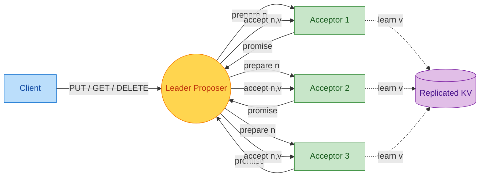
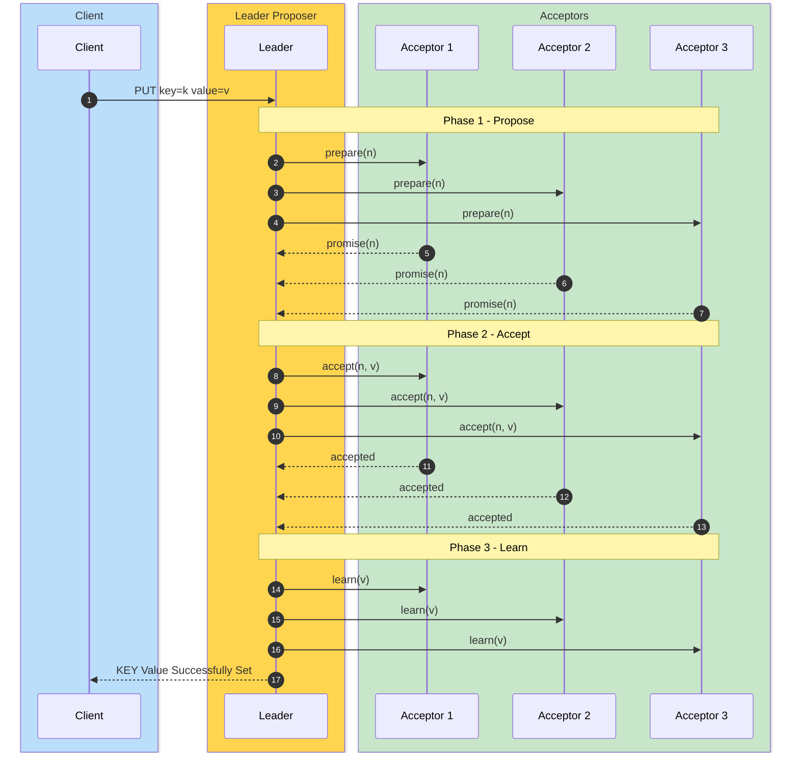
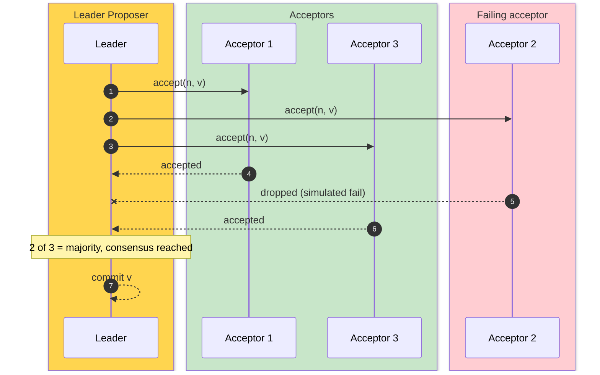
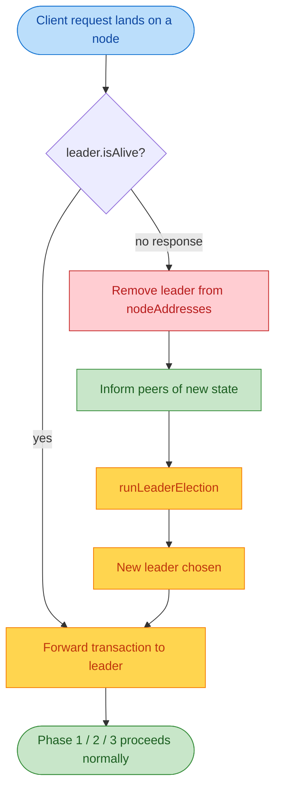

# PAXOS KEY-VALUE STORE

A replicated key-value store backed by the Paxos consensus protocol. Every node runs all three Paxos roles (Proposer, Acceptor, Learner) over Java RMI. The cluster is containerized: one Paxos node per Docker container on a user-defined bridge network.

## Quick Start

```shell
make up         # build image, bring up a CLUSTER_SIZE-node cluster
make client     # interactive REPL: put / get / delete
make smoke      # automated PUT/GET round-trip assertion
make down       # tear it all down
```

Client REPL session:

```text
paxos> put HELLO WORLD
KEY Value Successfully Set
paxos> get HELLO
WORLD
paxos> delete HELLO
Key-Value Successfully Deleted
paxos> exit
```

## Configuration

All knobs live in `.env`:

```env
CLUSTER_SIZE=5     # any positive integer; node0 is always the init node
ACCEPT_FAIL=0.0    # simulated acceptor failure rate per round
PROPOSE_FAIL=0.0   # simulated proposer failure rate per round
```

`docker-compose.yml` is generated from `.env` by `scripts/gen-compose.sh` on every `make up`. `ACCEPT_FAIL` and `PROPOSE_FAIL` are substituted into the running containers at compose time; change them and `make up` again to exercise the retry / leader-fail-over path.

## Overview of Paxos

Every node in the cluster runs all three Paxos roles at once: it is a **Proposer**, an **Acceptor**, and a **Learner**. One node is elected **Leader** and is the only one that drives client transactions.

### Protocol

The leader runs three phases for every transaction. A strict majority of acceptors must respond at every phase for the value to be chosen, and the protocol retries the whole sequence with a fresh sequence number if any phase falls short.

1. **Phase 1 - Propose (Prepare).** The leader picks a sequence number `n` larger than anything it has used and calls `Propose(n)` on every acceptor. An acceptor that has not promised a higher number records `n` as its new `PromisedSequenceNumber` and replies `Ack.YES`. An acceptor that has already promised a higher number replies `Ack.NO`.
2. **Phase 2 - Accept.** Once the leader collects a majority of `YES` votes, it calls `Accept(n, v)` on every acceptor with the proposed value `v`. Acceptors whose promise still matches `n` reply with the accepted packet; stale proposals are returned with the response field set to `Ignored`. This is the phase wrapped in the simulated `ACCEPT_FAIL` failure on each acceptor, so the leader counts successful accepts against a majority threshold before continuing.
3. **Phase 3 - Learn.** With a majority of accepts, the leader calls `Learn(v)` on every node, which dispatches the PUT / GET / DELETE through `KeyValueStore` and emits the response back to the client. If the leader did not get a majority of accepts the whole sequence is retried with a fresh `n`.



### Normal Happy Path

The leader drives a three-phase exchange. A majority of acceptors must reply at every phase for the value to be committed.



### On Acceptor Failure

Acceptors fail at random with probability `ACCEPT_FAIL` per accept. As long as a strict majority still responds, consensus is reached and the value is committed across the network.



### Leader Failing

Before a node informs the leader, it checks `leader.isAlive()`. If the leader does not respond, the node assumes it is dead, removes it from the network, informs the other nodes of the new state, and runs a fresh leader election. The new leader then takes over driving transactions. You can demonstrate this with `docker compose stop nodeN` while a client is running.



### Leader Election

Election itself is a deterministic **max-ID wins** rule, not a voting round. Every node runs `runLeaderElection()` in `Node.java` independently and walks its own `nodeAddresses` set, picking the `NodeAddress` whose numeric ID is the largest. Because every node keeps the same view of `nodeAddresses` through the `inform` / `informOfNewNode` flow, all of them converge on the same leader without exchanging extra messages.

It is triggered in three situations:

- The very first transaction lands on a node and `leader` is still `null` (first call to `Put` / `Get` / `Delete`).
- `leader.isAlive()` returns `false`. That call is an RMI lookup for `Node-<id>` against the recorded IP and port (see `NodeAddress.isAlive()`); any `RemoteException` or `NotBoundException` is treated as dead.
- A peer notices the leader is gone, removes it from its own `nodeAddresses`, calls `informOfNewNode()` to push the new view to everyone, and reruns the election.


A node that has not yet been informed of the latest membership change can briefly disagree about who the leader is, which is why the first thing the leader does on a new transaction is verify `leader.isAlive()` and rerun the election if it does not match.

## Make Targets

| Target | What it does |
|--------|--------------|
| `make build` | `mvn clean package` -> `target/KVStore2PC.jar` |
| `make test` | `mvn test` (JUnit + Cucumber) |
| `make up` | bring up CLUSTER_SIZE-node docker cluster |
| `make down` | tear down the cluster |
| `make client` | interactive REPL against the live cluster |
| `make smoke` | PUT/GET round-trip assertion |
| `make logs` | follow `docker compose logs` |
| `make clean` | `mvn clean` + remove generated `docker-compose.yml` |

## Tests

`make test` runs the Maven suite:

- **NodeTest** (JUnit 5): single-node coverage of the constructor, KeyValueStore semantics (put / get / delete, missing-key sentinel, duplicate refusal), and `Propose()` promise tracking.
- **WritePathTest** (JUnit 5): in-process exercise of the PROPOSE / ACCEPT / LEARN write path with zero simulated failure rate. Covers PUT propagation, stale-sequence rejection, idempotent delete, duplicate-put refusal, and GET as a no-op.
- **RunCucumberTest** (Cucumber + JUnit Platform Suite): BDD scenarios in `src/test/resources/features/kvstore.feature` backed by `KVStoreSteps`.

Multi-node end-to-end coverage is the docker `make smoke`.