# PAXOS KEY-VALUE STORE

A replicated key-value store backed by the Paxos consensus protocol. Every node runs all three Paxos roles (Proposer, Acceptor, Learner) over Java RMI. Consensus is **per key**: each key is its own independent single-decree instance, so writes to different keys commit in parallel while writes to the same key are linearized. **Writes** (PUT / DELETE) run the full three-phase protocol; **reads** (GET) are served directly from the leader's local store, since the leader holds the authoritative copy of every committed value. The cluster is containerized: one Paxos node per Docker container on a user-defined bridge network.

## Quick Start

```shell
make up         # build image, bring up a CLUSTER_SIZE-node cluster
make client     # interactive REPL: put / get / delete
make smoke      # automated PUT/GET round-trip assertion
make thread     # concurrent client: one thread per key, PUT/GET/DELETE
make down       # tear it all down
```

Client REPL session:

```text
paxos> put HELLO WORLD
KEY Value Successfully Set
paxos> get HELLO
WORLD
paxos> delete HELLO
Key-Value Successfully Deleted
paxos> exit
```

## Configuration

All knobs live in `.env`:

```env
CLUSTER_SIZE=10    # any positive integer; node0 is always the init node
MSG_LOSS=0.1       # real per-message loss rate on the Paxos RPCs
ACCEPT_FAIL=0.0    # legacy fault injector, currently disabled (not wired)
PROPOSE_FAIL=0.0   # legacy: currently unused (no-op)
```

`docker-compose.yml` is generated from `.env` by `scripts/gen-compose.sh` on every `make up`, and the knobs are substituted into the running containers at compose time.

- **`MSG_LOSS`** is real network message loss: each outgoing Propose / Accept is dropped with this probability (`RmiTransport.lookupWithLoss`). The proposer retries with a fresh ballot, so loss is transient, not fatal. This is the knob the validation harness drives. Cluster join and the post-consensus Commit use a plain lookup that is never dropped, so a chosen value is never lost.
- **`ACCEPT_FAIL`** and **`PROPOSE_FAIL`** are legacy fault-injection knobs. They are **not currently wired** into the running code (`PaxosConfig.acceptorFailRate` is never set from `Node`), so they are effectively no-ops; use `MSG_LOSS` to exercise the retry path.

## Overview of Paxos

Every node in the cluster runs all three Paxos roles at once: it is a **Proposer**, an **Acceptor**, and a **Learner**. One node is elected **Leader** and is the only one that drives client transactions; `Leader.java` (which wraps `LeaderElection`) resolves the current leader and forwards each transaction to it.

### Per-key consensus (parallel decrees)

Rather than one global consensus register, **each key is an independent single-decree Paxos instance**:

- `PaxosAcceptor` keeps one register (`promised` / `acceptedBallot` / `acceptedValue`) **per key**, guarded by that key's own monitor.
- `PaxosProposer` holds a **per-key round lock** and a **per-key ballot counter**. A round for a key runs to completion (Prepare -> Accept -> Commit) before the next round for the *same* key starts, so there is no ballot preemption and no retry storm; rounds for *different* keys run concurrently.

The net effect: concurrent clients writing distinct keys make progress in parallel, and concurrent clients contending on one key are serialized into a single winner. This is asserted by the `@Tag("spec")` test `unrelatedKeysDoNotShareConsensusState` (run with `mvn test -Pspec`).

### Protocol

Reads and writes take different paths. A **GET** is answered by the leader directly from its own `KeyValueStore` (`Node.hasTransaction` short-circuits before Phase 1) -- the leader is the node that drives every write, so its store is the authoritative copy and no consensus round is needed to read. A **PUT / DELETE** is a decree: the leader runs three phases against a strict majority of acceptors, and retries the whole sequence with a fresh ballot (up to `PaxosConfig.PROPOSER_MAX_ATTEMPTS`, default 3) if any phase falls short. A ballot is `n = <perKeySequence>.<leaderId>`.

1. **Phase 1 - Prepare (Propose).** The leader calls `Propose(key, n)` on every acceptor. An acceptor that has not promised a higher ballot *for that key* records `n` and replies with a `Promise` (carrying any value it has already accepted for the key); otherwise it replies `Promise.rejected()`.
2. **Phase 2 - Accept.** Once a majority promises, the leader selects the value -- re-proposing any already-accepted value tied to the highest ballot (`chooseAcceptedValue`, the Paxos safety rule) -- and calls `Accept(n, packet)` on every acceptor. Matching acceptors reply `Accepted`; stale ones return the packet marked `Ignored`. The accept fan-out is bounded by a timeout that cancels any straggler so no work leaks.
3. **Phase 3 - Commit (Learn).** With a majority of accepts the value is **chosen**. Only now does the leader call `Commit(packet)` on every replica, which applies it through `PaxosLearner` to the `KeyValueStore` and clears that key's slot (`advanceInstance(key)`) so the next write to the key is a fresh decree. Commit uses a plain lookup that is never dropped, so a chosen value is never lost to simulated message loss. The leader's applied result is returned to the client.

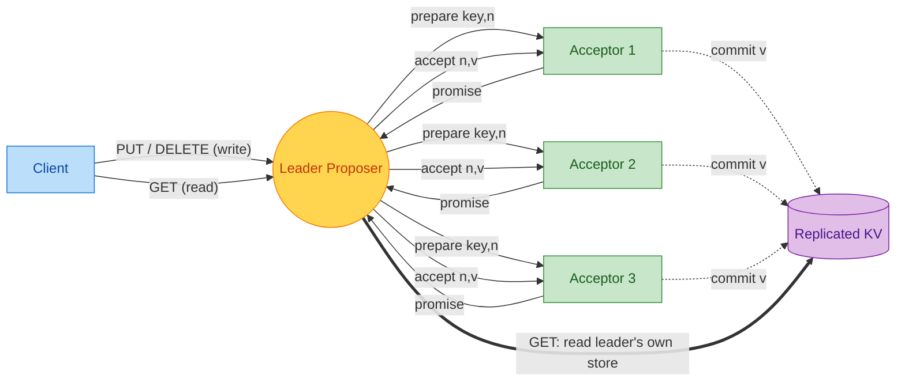
```mermaid
flowchart LR
    C[Client]:::client -->|"PUT / DELETE (write)"| L((Leader Proposer)):::leader
    C -->|"GET (read)"| L
    L -->|prepare key,n| A1[Acceptor 1]:::acceptor
    L -->|prepare key,n| A2[Acceptor 2]:::acceptor
    L -->|prepare key,n| A3[Acceptor 3]:::acceptor
    A1 -->|promise| L
    A2 -->|promise| L
    A3 -->|promise| L
    L -->|accept n,v| A1
    L -->|accept n,v| A2
    L -->|accept n,v| A3
    A1 -.->|commit v| LR[(Replicated KV)]:::kv
    A2 -.->|commit v| LR
    A3 -.->|commit v| LR
    L ==>|"GET: read leader's own store"| LR
    classDef client fill:#bbdefb,stroke:#1976d2,color:#0d47a1
    classDef leader fill:#ffd54f,stroke:#f57c00,color:#bf360c
    classDef acceptor fill:#c8e6c9,stroke:#388e3c,color:#1b5e20
    classDef kv fill:#e1bee7,stroke:#7b1fa2,color:#4a148c
```

### Normal Happy Path (write)

For a PUT / DELETE the leader drives the three-phase exchange. A majority of acceptors must reply at every phase for the value to be chosen and committed. (A GET skips all of this: the leader reads its own store and replies in one hop.)

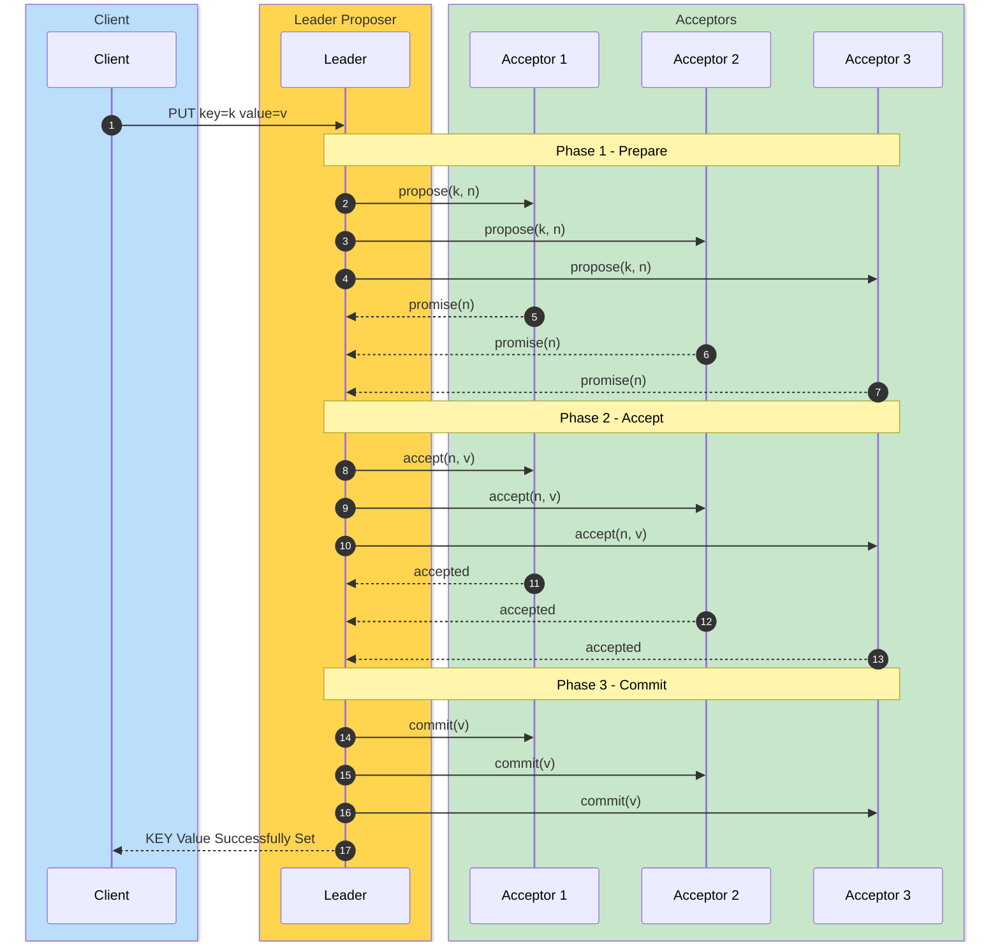
```mermaid
sequenceDiagram
    autonumber
    box rgb(187,222,251) Client
        participant C as Client
    end
    box rgb(255,213,79) Leader Proposer
        participant L as Leader
    end
    box rgb(200,230,201) Acceptors
        participant A1 as Acceptor 1
        participant A2 as Acceptor 2
        participant A3 as Acceptor 3
    end

    C->>L: PUT key=k value=v
    Note over L,A3: Phase 1 - Prepare
    L->>A1: propose(k, n)
    L->>A2: propose(k, n)
    L->>A3: propose(k, n)
    A1-->>L: promise(n)
    A2-->>L: promise(n)
    A3-->>L: promise(n)

    Note over L,A3: Phase 2 - Accept
    L->>A1: accept(n, v)
    L->>A2: accept(n, v)
    L->>A3: accept(n, v)
    A1-->>L: accepted
    A2-->>L: accepted
    A3-->>L: accepted

    Note over L,A3: Phase 3 - Commit
    L->>A1: commit(v)
    L->>A2: commit(v)
    L->>A3: commit(v)
    L-->>C: KEY Value Successfully Set
```

### On Message Loss

Each outgoing Propose / Accept is dropped with probability `MSG_LOSS`. As long as a strict majority still responds, consensus is reached and the value is committed across the network; otherwise the round retries with a fresh ballot.

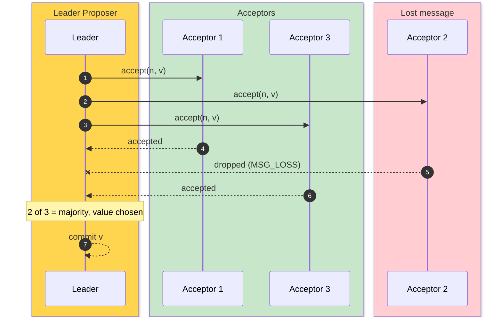
```mermaid
sequenceDiagram
    autonumber
    box rgb(255,213,79) Leader Proposer
        participant L as Leader
    end
    box rgb(200,230,201) Acceptors
        participant A1 as Acceptor 1
        participant A3 as Acceptor 3
    end
    box rgb(255,205,210) Lost message
        participant A2 as Acceptor 2
    end

    L->>A1: accept(n, v)
    L->>A2: accept(n, v)
    L->>A3: accept(n, v)
    A1-->>L: accepted
    A2--xL: dropped (MSG_LOSS)
    A3-->>L: accepted
    Note over L: 2 of 3 = majority, value chosen
    L-->>L: commit v
```

### Leader Failing

Before forwarding a transaction, `Leader` checks the current leader's `isAlive()`. If that RMI call returns `false` or throws, the leader is treated as dead: it is removed from the peer set, the other nodes are informed of the new membership, and a fresh election is run. The new leader then takes over. You can demonstrate this with `docker compose stop nodeN` while a client is running.

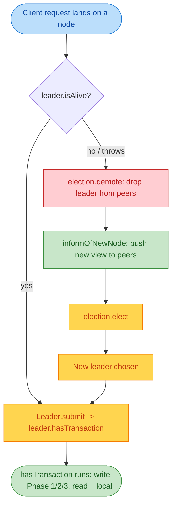
```mermaid
flowchart TD
    Start([Client request lands on a node]):::client --> Check{leader.isAlive?}
    Check -- yes --> Forward[Leader.submit -> leader.hasTransaction]:::leader
    Check -- no / throws --> Remove[election.demote: drop leader from peers]:::fail
    Remove --> Inform[informOfNewNode: push new view to peers]:::acceptor
    Inform --> Elect[election.elect]:::leader
    Elect --> NewLeader[New leader chosen]:::leader
    NewLeader --> Forward
    Forward --> Done([hasTransaction runs: write = Phase 1/2/3, read = local]):::acceptor
    classDef client fill:#bbdefb,stroke:#1976d2,color:#0d47a1
    classDef leader fill:#ffd54f,stroke:#f57c00,color:#bf360c
    classDef acceptor fill:#c8e6c9,stroke:#388e3c,color:#1b5e20
    classDef fail fill:#ffcdd2,stroke:#c62828,color:#b71c1c
```

### Leader Election

Election is a deterministic **max-ID wins** rule, not a voting round. `LeaderElection.elect()` walks the node's own `peers` set and picks the `NodeAddress` whose numeric ID is largest, then looks up that node's RMI stub. Because every node keeps the same membership view through the `inform` / `informOfNewNode` flow, all of them converge on the same leader without exchanging extra messages.

It is triggered when:

- The first transaction lands and no leader has been resolved yet.
- The current leader's `isAlive()` RMI call returns `false` or throws (handled in `Leader`).
- A peer removes a dead leader (`election.demote()`), pushes the new membership with `informOfNewNode()`, and re-elects.

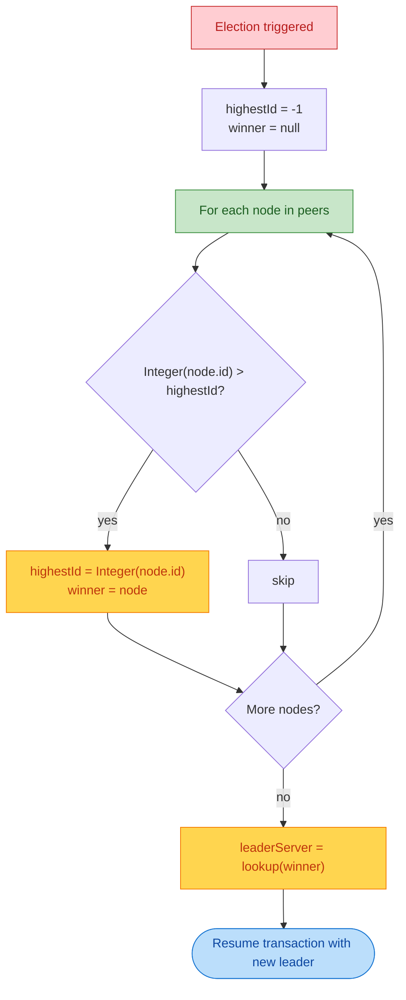
```mermaid
flowchart TD
    T[Election triggered]:::fail --> Init["highestId = -1<br/>winner = null"]
    Init --> Iter[For each node in peers]:::acceptor
    Iter --> Cmp{"Integer(node.id) > highestId?"}
    Cmp -- yes --> Upd["highestId = Integer(node.id)<br/>winner = node"]:::leader
    Cmp -- no --> Skip[skip]
    Upd --> Cont{More nodes?}
    Skip --> Cont
    Cont -- yes --> Iter
    Cont -- no --> Set["leaderServer = lookup(winner)"]:::leader
    Set --> Resume([Resume transaction with new leader]):::client
    classDef client fill:#bbdefb,stroke:#1976d2,color:#0d47a1
    classDef leader fill:#ffd54f,stroke:#f57c00,color:#bf360c
    classDef acceptor fill:#c8e6c9,stroke:#388e3c,color:#1b5e20
    classDef fail fill:#ffcdd2,stroke:#c62828,color:#b71c1c
```

A node that has not yet been informed of the latest membership change can briefly disagree about who the leader is, which is why `Leader` verifies `isAlive()` and re-elects on each transaction if the current leader does not respond.

## Make Targets

| Target | What it does |
|--------|--------------|
| `make build` | `mvn clean package` -> `target/KVStore2PC.jar` |
| `make test` | `mvn test` (JUnit + Cucumber; excludes `@Tag("spec")`) |
| `make up` / `make down` | bring up / tear down the CLUSTER_SIZE-node docker cluster |
| `make client` | interactive REPL against the live cluster |
| `make smoke` | dockerized PUT/GET round-trip assertion |
| `make thread` | concurrent client (one thread per key), self-verifying |
| `make validate-paxos` | correctness gate: `python3 -m validation` (linearizability, missing_key, quorum_tolerance, retry_convergence) |
| `make saturation` | performance harness `scripts/saturation.py` (T1/T2/T3; informational, not a gate) |
| `make validate` / `make metrics` | fault-tolerance/throughput matrix + figures (`scripts/generate_charts.py`) |
| `make logs` | follow `docker compose logs` |
| `make clean` | `mvn clean` + remove generated `docker-compose.yml` and `metrics/` |

## Tests

`make test` runs the Maven unit suite (JUnit 5 + Cucumber), which excludes `@Tag("spec")` tests. Highlights:

- **PaxosAcceptorTest / PaxosProposerTest / PaxosLearnerTest / KeyValueStoreTest**: the Paxos roles in isolation -- per-key promise/accept/advance, Phase-2 value selection (`chooseAcceptedValue`), decree application, and concurrent-put single-winner semantics.
- **NodeTest / WritePathTest**: single-node coverage of the constructor, KeyValueStore semantics (put / get / delete, missing-key sentinel, duplicate refusal), and the in-process Propose / Accept / Learn write path.
- **LeaderElectionTest**: max-ID election and demotion.
- **RunCucumberTest**: BDD scenarios in `src/test/resources/features/kvstore.feature` backed by `KVStoreSteps`.


Multi-node end-to-end coverage lives in the docker targets: `make smoke`, `make thread`, and `make validate-paxos`.


## Empirical Validation

### Concurrency correctness -- `make validate-paxos`

`python3 -m validation` brings up one cluster and runs every correctness property against it as its own named validator (judge under `--config clean`). It is the gate for concurrent-client correctness:

| Property | Guarantee | Status |
|----------|-----------|--------|
| `linearizability` | single-winner + no-loss / no-resurrect | PASS |
| `missing_key` | missing-key sentinel contract (`KEY does not exist`) | PASS |
| `retry_convergence` | idempotent + converges to a single winner | PASS |
| `quorum_tolerance` | reads survive `floor((N-1)/2)` failures | PASS |

- **`linearizability`** -- concurrent PUTs to one key choose exactly one winner drawn from the proposed set; the value is never lost and never resurrected after a DELETE.
- **`missing_key`** -- a GET on a never-PUT key returns exactly the missing sentinel `KEY does not exist` on every node.
- **`quorum_tolerance`** -- reads survive up to `floor((N-1)/2)` node failures (node0 + the max-id leader stay alive; middle nodes are stopped one at a time).
- **`retry_convergence`** -- repeated / concurrent writes converge to a single value with no split-brain, even when the proposer has to retry.

Each validator is also runnable on its own, e.g. `python3 -m validation.missing_key --config clean` (add `--no-manage-cluster` to reuse an already-up `make up` cluster). Performance is separate and informational: `make saturation` (`scripts/saturation.py`) runs T1 error/latency vs concurrency, T2 sustained-load drift (thread-leak detector), and T3 recovery after a burst, writing figures to `img/`:

| Error rate vs concurrency (0% at every level) | Latency vs concurrency |
| :---: | :---: |
| 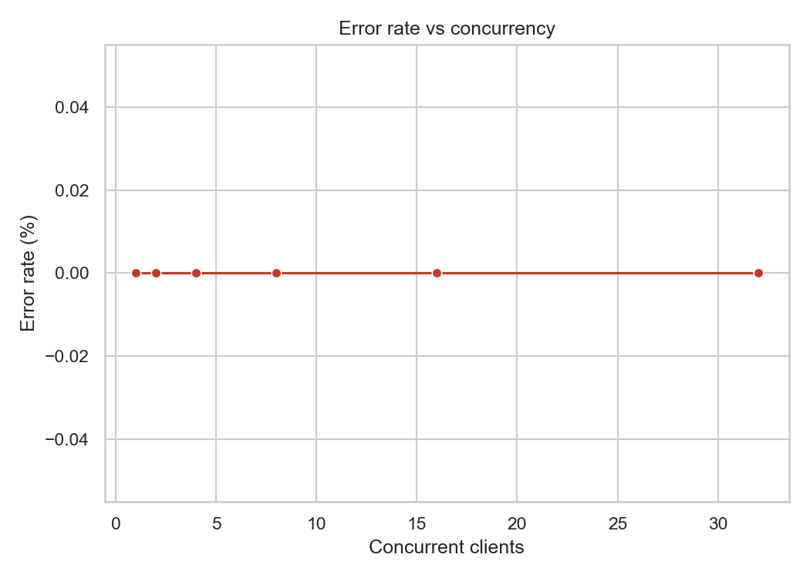 | 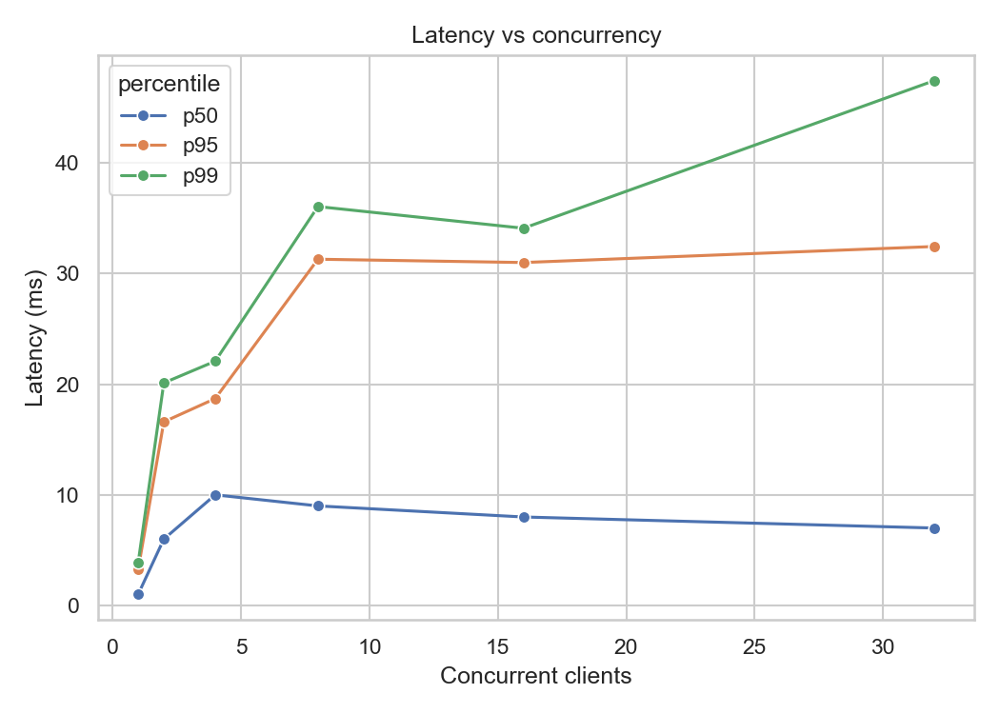 |

| Sustained-load drift (T2 thread-leak detector) | |
| :---: | :---: |
| 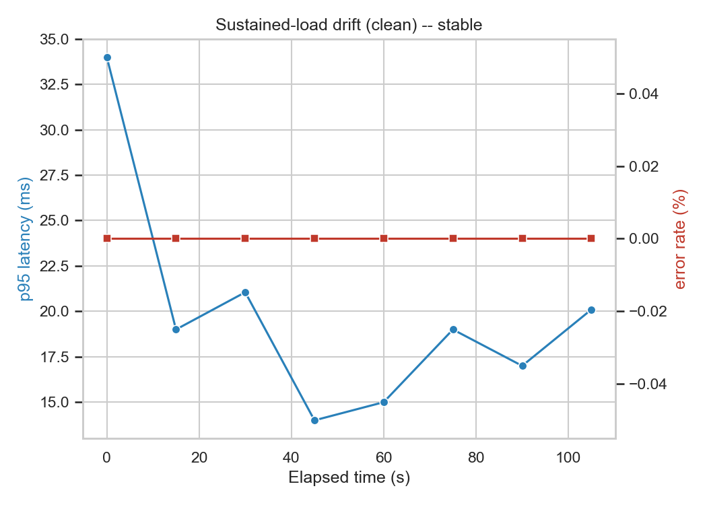 |  |

For fast iteration use reduced runs, e.g. `python3 -m validation --keys 3 --writers 4 --reads 6` (the saturation harness is the slow part, ~20-30 min, and is not on the gate). `Validate.java` identifies values by `sha1(Response.body)`, so a GET returns the raw stored value and a missing GET returns exactly `KEY does not exist`.

### Fault tolerance & throughput -- `make validate` + `make metrics`

`scripts/validate.sh` + `scripts/generate_charts.py` run a containerized experiment that writes figures to `img/` plus a `metrics/summary.txt`:

1. **Fault tolerance (`quorum_tolerance.png`).** A fixed-N quorum sweep: `node0` (the query target) and the max-ID leader always survive, and the middle nodes are stopped one at a time. Because the leader never dies, membership is never pruned and the majority threshold stays `N/2+1`, so GET success collapses exactly when live nodes fall below majority -- a clean step at `floor((N-1)/2)` failures tolerated (4 for a 10-node cluster).
2. **Cost of message loss (`throughput.png`, `latency_loss.png`, `retries.png`).** The `load` phase runs twice: once clean (`MSG_LOSS=0`) and once under real per-message loss, so throughput (successful ops/sec, measured in-process from per-op latency, excluding container/JVM startup), latency, and Paxos retry counts are reported as baseline-vs-loss.
3. **Zero data loss.** Every verify/load GET reads the value back and compares it to the exact value that was PUT; `summary.txt` reports the count of successful GETs whose value did not match (should be 0).

| Fault tolerance (fixed-N quorum sweep) | Throughput: baseline vs message loss |
| :---: | :---: |
| 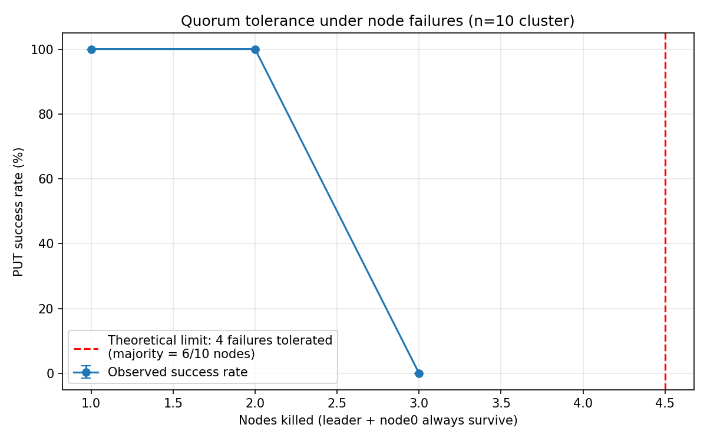 | 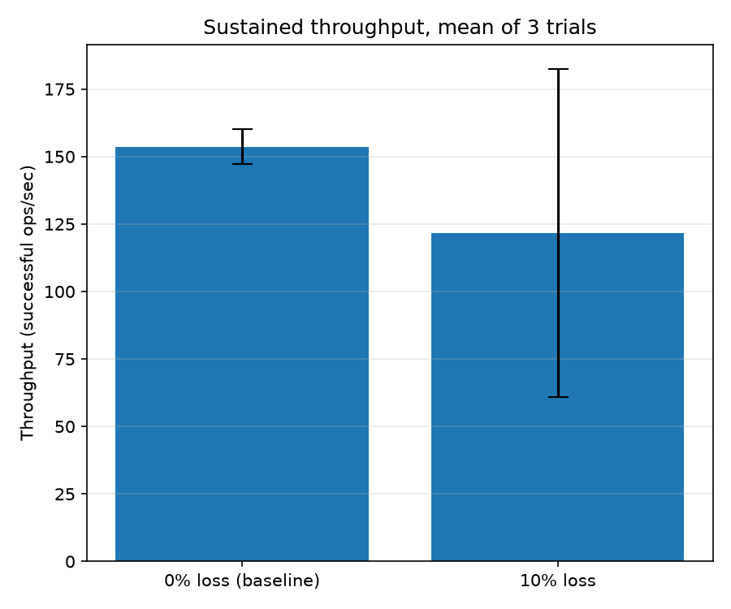 |

| Latency under message loss | Paxos retries under loss |
| :---: | :---: |
| 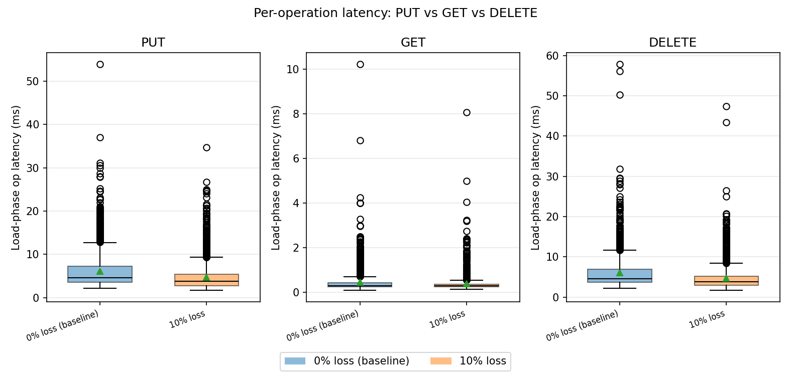 | 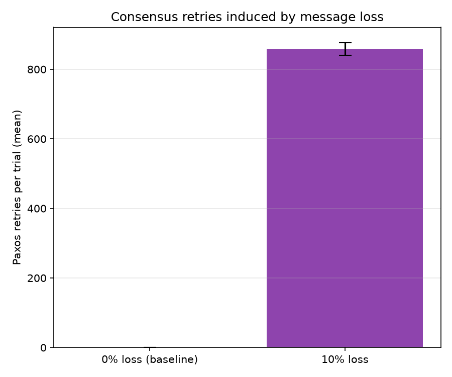 |

Knobs: `TRIALS`, `THROUGHPUT_REPEATS`, `CLUSTER_SIZE`, and `MSG_LOSS_RATE` (the loss rate used for the lossy condition).
