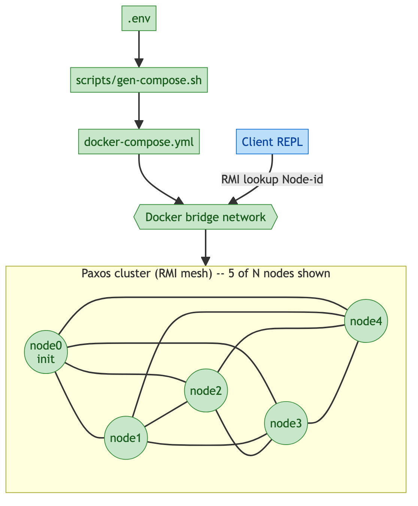
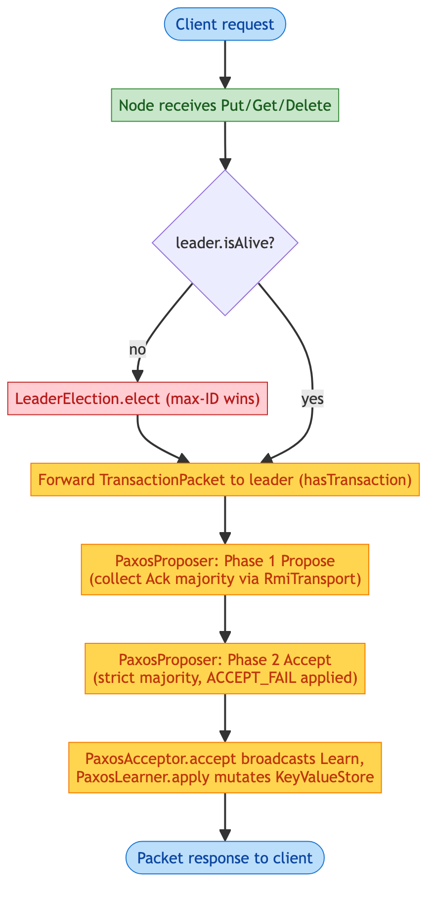

\newpage
\tableofcontents
\newpage

**GitHub:** [https://github.com/magana272/PAXOS-Key-Value-Store](https://github.com/magana272/PAXOS-Key-Value-Store)

# 1. Problem Statement

A single-node key-value store is a single point of failure: if the process dies, every client loses access to the data. Naively replicating writes across several nodes does not solve the problem either, since concurrent clients and lost messages can drive replicas out of sync.

What is needed is a key-value store that stays consistent across a cluster of nodes even when some of them fail or drop messages. The Paxos consensus protocol is the canonical answer to that problem; this project implements it end-to-end over Java RMI.

# 2. Objective

Provide a small, self-contained system that:

- Replicates `PUT` / `GET` / `DELETE` operations across an N-node cluster.
- Reaches consensus via the three-phase Paxos protocol (Propose, Accept, Learn).
- Tolerates acceptor failures up to a strict minority.
- Recovers from leader loss through a deterministic max-ID re-election.
- Runs as one node per Docker container on a user-defined bridge network.
- Exposes a minimal interactive REPL client for manual exercise.

# 3. Scope

## In Scope

- Java RMI transport for all inter-node and client-node calls.
- All three Paxos roles (Proposer, Acceptor, Learner) co-located on every node.
- Leader election with `leader.isAlive()` health check.
- Simulated per-round acceptor and proposer failure injection.
- In-memory `KeyValueStore` (no persistence across container restarts).
- Docker Compose cluster generated from `.env` (`CLUSTER_SIZE`, `ACCEPT_FAIL`, `PROPOSE_FAIL`).
- JUnit + Cucumber test suites and a docker-based smoke test.

## Out of Scope

- Durable on-disk storage / write-ahead log.
- Snapshotting or log compaction.
- TLS or authentication between nodes or clients.
- Cross-datacenter deployment.
- Dynamic cluster membership at runtime (the cluster size is fixed at compose time).

<!-- \newpage -->

# 4. System Overview

The system is a flat cluster of identical Paxos nodes plus a thin client process:

| Executable | Purpose |
|---|---|
| `Node` (`make up`) | One Paxos node per Docker container. Runs Proposer, Acceptor, and Learner. |
| `Client` (`make client`) | Interactive REPL that issues `PUT` / `GET` / `DELETE` against the cluster. |
| Smoke driver (`make smoke`) | Automated `PUT` / `GET` round-trip assertion. |

Every container exposes its node over the JVM RMI registry as `Node-<id>`. `node0` is always the bootstrap node; every other node joins by calling `informOfNewNode()` against the existing membership. The leader is elected on the first client transaction and re-elected whenever the current leader stops responding.

# 5. Functional Requirements

## Client API

- `put <key> <value>` -- replicate a new key-value pair across the cluster. Refuses duplicate keys.
- `get <key>` -- read a key. Returns a sentinel string when the key is missing.
- `delete <key>` -- remove a key. Idempotent on missing keys.
- `exit` -- close the REPL.

## Consensus

- Every transaction goes through three phases: Propose, Accept, Learn.
- A strict majority of acceptors must respond at every phase for the value to be chosen.
- If any phase falls short of a majority, the leader retries the whole sequence with a fresh sequence number `n`.
- Acceptors track the highest `PromisedSequenceNumber` they have seen and reject stale proposals.

## Failure Handling

- Acceptors fail per round with probability `ACCEPT_FAIL`; consensus still succeeds as long as a strict majority replies.
- Proposers fail per round with probability `PROPOSE_FAIL`; the leader detects the shortfall and retries.
- Leader loss is detected by `leader.isAlive()` (an RMI lookup against the recorded `NodeAddress`); any `RemoteException` or `NotBoundException` is treated as dead and a re-election runs.
- Re-election is a deterministic max-ID rule: every node walks its own `nodeAddresses` set and picks the highest numeric ID. Because every node keeps the same membership view, all of them converge on the same leader without an explicit voting round.

## Operations

- `make up` builds the image and brings up a `CLUSTER_SIZE`-node cluster.
- `make down` tears the cluster down.
- `make client` / `make smoke` run interactive and automated clients against the live cluster.
- `make logs` follows `docker compose logs`.
- `make test` runs the Maven JUnit + Cucumber suite.

<!-- \newpage -->

# 6. Non-Functional Requirements

## Correctness

- Linearizable `PUT` / `GET` / `DELETE` once a value is committed by the leader's Learn phase.
- Duplicate `PUT` for the same key is refused at the `KeyValueStore` layer.
- `DELETE` is idempotent on a missing key.

## Availability

- The cluster tolerates up to `floor((N-1)/2)` simultaneous acceptor failures and still commits.
- A new leader is elected within one round trip after the previous leader stops responding.

## Simplicity

- One executable jar (`KVStore2PC.jar`); no external broker, database, or coordinator.
- Configuration lives in a single `.env` file; `docker-compose.yml` is regenerated from it on every `make up`.

## Reproducibility

- The cluster is fully containerized; `make up` brings the same topology up on any Docker host.
- Failure rates are externally injected via `ACCEPT_FAIL` / `PROPOSE_FAIL`, so retry and re-election paths can be exercised deterministically.

## Portability

- Java 17, Maven, Docker Compose. No platform-specific code.

<!-- \newpage -->

# 7. Architecture

## Package Structure

```
manuel.rpckvstore/
  Client.java                        -- REPL + connection logic
  Example.java                       -- bundled demo workload
  NodeAddress.java                   -- RMI address record + isAlive() health check
  Node/
    Node.java                        -- RMI facade; delegates each BaseServer
                                        method to a collaborator below
    BaseServer.java                  -- aggregate remote interface; extends the
                                        three role interfaces
    PaxosConfig.java                 -- accept-phase timeout, retry count,
                                        and injected fail rates
    Proposer/
      ProposerInterface.java         -- remote contract
      PaxosProposer.java             -- bounded-retry two-phase driver
    Acceptor/
      AcceptorInterface.java         -- remote contract
      PaxosAcceptor.java             -- promise state + broadcast-then-apply
    Learner/
      LearnerInterface.java          -- remote contract
      PaxosLearner.java              -- applies committed packets
      KeyValueStore.java             -- HashMap guarded by RW lock
      KvTasks.java                   -- put / get / delete Callables
      KeyValue.java, LockState.java
    cluster/
      PeerDirectory.java             -- live peer set
      RmiTransport.java              -- single RMI lookup site
      LeaderElection.java            -- max-id election
      ClusterMembership.java         -- join, inform, connectToInitialNode
  Packet/
    Packet.java, PacketLogger.java
    TransactionPacket.java, Vote.java, Ack.java, TYPE.java
```

`Node` is a thin facade: it implements `BaseServer` (which extends `ProposerInterface`, `AcceptorInterface`, and `LearnerInterface`) and forwards each RMI call to the matching collaborator. `PaxosProposer` walks the `PeerDirectory` snapshot and drives the two-phase round through `RmiTransport`.

## Transaction Flow

1. The client calls `Put` / `Get` / `Delete` on any node via RMI. `Node.routeThroughLeader()` is the entry point.
2. The receiving node checks `leader.isAlive()`; if the leader is missing or dead, it drops the leader from `PeerDirectory`, calls `ClusterMembership.informOfNewNode()` to push the new view, and runs `LeaderElection.elect()` (max-ID wins).
3. The node forwards a `TransactionPacket` to the leader via `BaseServer.hasTransaction()`.
4. On the leader, `PaxosProposer.propose()` runs a round with a fresh proposal id (`sequenceNumber + "." + nodeId`). Phase 1 (Propose) collects votes from all peers via `RmiTransport`; a strict majority of `Ack.YES` is required.
5. Phase 2 (Accept) is run in parallel using a per-round thread pool. Each peer's `PaxosAcceptor.accept()` either returns the packet marked `Ignored` (its promise has moved on), or -- with probability `1 - ACCEPT_FAIL` -- broadcasts `Learn` to every peer and applies the packet locally through `PaxosLearner`. Per-peer futures are bounded by `PaxosConfig.ACCEPT_PHASE_TIMEOUT_MS` (100 ms).
6. `PaxosLearner.apply()` dispatches the packet through `KvTasks` against the in-memory `KeyValueStore` and returns the response.
7. If the round falls short of a majority at any phase, `PaxosProposer` retries with a fresh sequence number up to `PaxosConfig.PROPOSER_MAX_ATTEMPTS` (10). After that, it throws `RemoteException`.

## Cluster Topology

{width=35% height=55%}

<!-- \newpage -->

# 8. Data Model

## In-memory Entities

**KeyValueStore** -- the replicated map. Wraps a `HashMap<String, String>` guarded by a `ReentrantReadWriteLock`. Exposes `put`, `get`, `delete`; `put` refuses duplicate keys (returns `false`), `get` returns a sentinel constant when the key is missing, `delete` returns whether the key was present.

**NodeAddress** -- `id`, `host`, `port`. Used both as a routing target (RMI lookup `Node-<id>`) and as a liveness probe (`isAlive()`).

**Promise** (acceptor-local, in `PaxosAcceptor`) -- the highest `n` an acceptor has promised. Drives the Phase 1 / Phase 2 reject path. Held as a nullable `Float` so the first proposal of a node's life is unconditionally accepted.

## Packet Types

All RMI calls take or return one of the records in `manuel.rpckvstore.Packet`:

- `Packet` -- request / response envelope. Carries the operation type, key, value, and (for responses) the result string.
- `TransactionPacket` -- proposer-side wrapper around a `Packet` plus a `Vote`; sent from the receiving node to the leader's `hasTransaction`.
- `Ack` (enum, `YES` / `NO`) -- acceptor's Phase 1 reply to `Propose(n)`.
- `Vote` (enum, `YES` / `NO`) -- the proposer's per-peer tally derived from the Phase 1 `Ack`s.
- `TYPE` (enum) -- `PUT`, `GET`, `DELETE`.

Phase 2 returns a `Packet` directly; stale proposals come back with `response = "Ignored"` rather than a dedicated enum.

## State Lifecycle

{width=35% height=35%}

<!-- \newpage -->

# 9. Configuration and Deployment

Three knobs live in `.env`:

| Variable | Meaning | Typical Values |
|---|---|---|
| `CLUSTER_SIZE` | Number of Paxos nodes in the cluster. `node0` is always the init node. | 3, 5, 10 |
| `ACCEPT_FAIL` | Probability that an acceptor drops a single Phase 2 request. | 0.0 (deterministic) -- 0.1 (exercise retry) |
| `PROPOSE_FAIL` | Probability that a proposer drops a single Phase 1 request. | 0.0 -- 0.1 |

`scripts/gen-compose.sh` reads `.env` and regenerates `docker-compose.yml` on every `make up`, baking the failure rates into each container's environment. Changing failure rates requires a `make up` cycle so the new environment is substituted into the running containers.

## Container Layout

- One container per node, named `node0` ... `nodeN-1`.
- All containers attached to a single user-defined bridge network so RMI lookups by `Node-<id>` resolve by container name.
- The image is a two-stage Maven build: `maven:3.9-eclipse-temurin-17` produces `KVStore2PC.jar`, then `eclipse-temurin:17-jre` runs it.

<!-- \newpage -->

# 10. Design Decisions

## Why every node runs all three Paxos roles

Co-locating Proposer, Acceptor, and Learner on every node keeps the protocol logic uniform: there is one node binary, one RMI interface, and one election rule. It also means any node can accept a client transaction and forward it to the current leader, instead of having a separate, smaller acceptor tier that becomes its own failure domain.

## Why Java RMI

RMI is built into the JDK and gives synchronous, typed remote calls without an external broker. For a cluster of fewer than a few dozen nodes on a shared Docker network, RMI is sufficient and keeps the wire format invisible. The tradeoff is JVM-only interop, which is fine for a teaching project but would be replaced by gRPC or a custom TCP framing layer for a production system.

## Why max-ID leader election instead of a vote

Because every node converges on the same `nodeAddresses` set through `informOfNewNode()`, a deterministic rule (largest ID wins) is enough: every node independently picks the same leader without exchanging extra messages. This avoids a second round of consensus on top of Paxos and keeps the failure path short. The downside is that the highest-ID node is always preferred, which would matter in a heterogeneous deployment but does not in a uniform cluster.

## Why simulated failure injection

`ACCEPT_FAIL` and `PROPOSE_FAIL` make the retry and re-election paths exercisable from the host without killing containers. Setting them to `0.0` gives a deterministic happy path for tests; raising them to `0.1` reliably triggers retries and leader handover without manual intervention.

## Why no on-disk persistence

The project's focus is consensus, not durability. Keeping the store in memory removes a class of failure modes (disk corruption, partial writes) from the test surface and keeps each container a clean slate on restart. Persisting the learned log would be the natural next step, but it would not change the consensus protocol itself.

## Why Docker Compose instead of a manual script

A multi-node cluster needs consistent networking, naming, and lifecycle. Compose gives all three for free and lets the cluster size scale by editing one variable. Generating `docker-compose.yml` from `.env` keeps the source of truth in one place and avoids drift between the env file and the compose file.

<!-- \newpage -->

# 11. Testing Strategy

## Approach

Tests are layered:

- **Unit tests (JUnit 5)** isolate a single node and its `KeyValueStore` / `Propose` semantics.
- **In-process integration (JUnit 5)** drives the full PROPOSE / ACCEPT / LEARN path with no simulated failure.
- **BDD scenarios (Cucumber)** verify client-visible behavior against the service layer.
- **Docker smoke test (`make smoke`)** asserts a full PUT / GET round-trip against a real `CLUSTER_SIZE`-node cluster.

## Test Coverage

| Suite | What it covers |
|---|---|
| **NodeTest** | Node facade: constructor wiring, peer set seeded with self, `Propose()` promise tracking through the delegated acceptor, two-node KV isolation. |
| **WritePathTest** | In-process PROPOSE / ACCEPT / LEARN with `ACCEPT_FAIL = PROPOSE_FAIL = 0`. Covers PUT propagation, stale-sequence rejection, idempotent delete, duplicate-put refusal, GET as a no-op. |
| **KeyValueStoreTest** | Direct concurrency test on `KeyValueStore`: 16 racing writers on the same key resolve to exactly one winner (regression test for the previous read-lock-for-writes bug). |
| **TransactionPacketTest** | `Vote` argument is honored by the constructor (the previous version hardcoded `YES`). |
| **PaxosLearnerTest** | Apply path in isolation: PUT writes, GET is read-only, DELETE removes. |
| **PaxosAcceptorTest** | Promise monotonicity: first propose accepts, lower proposal rejected, higher proposal updates, accept below promise leaves the store unchanged. |
| **LeaderElectionTest** | Max-id election picks the largest numeric id; `demote` clears the current leader. |
| **RunCucumberTest** | BDD scenarios in `src/test/resources/features/kvstore.feature` backed by `KVStoreSteps`. |
| **make smoke** | End-to-end PUT / GET round-trip against the live docker cluster. |

## What is exercised

- Happy path: client request -> leader election -> three phases -> response.
- Acceptor failure: `ACCEPT_FAIL > 0`, majority still reached, value committed.
- Stale proposals: acceptor returns `Ignored` when its promise has moved past `n`.
- Leader loss: stopping the current leader (`docker compose stop nodeN`) while a client is running forces re-election and the next transaction proceeds against the new leader.

## Running tests

```bash
make test    # mvn test -- JUnit + Cucumber
make smoke   # docker-based end-to-end PUT / GET
```
